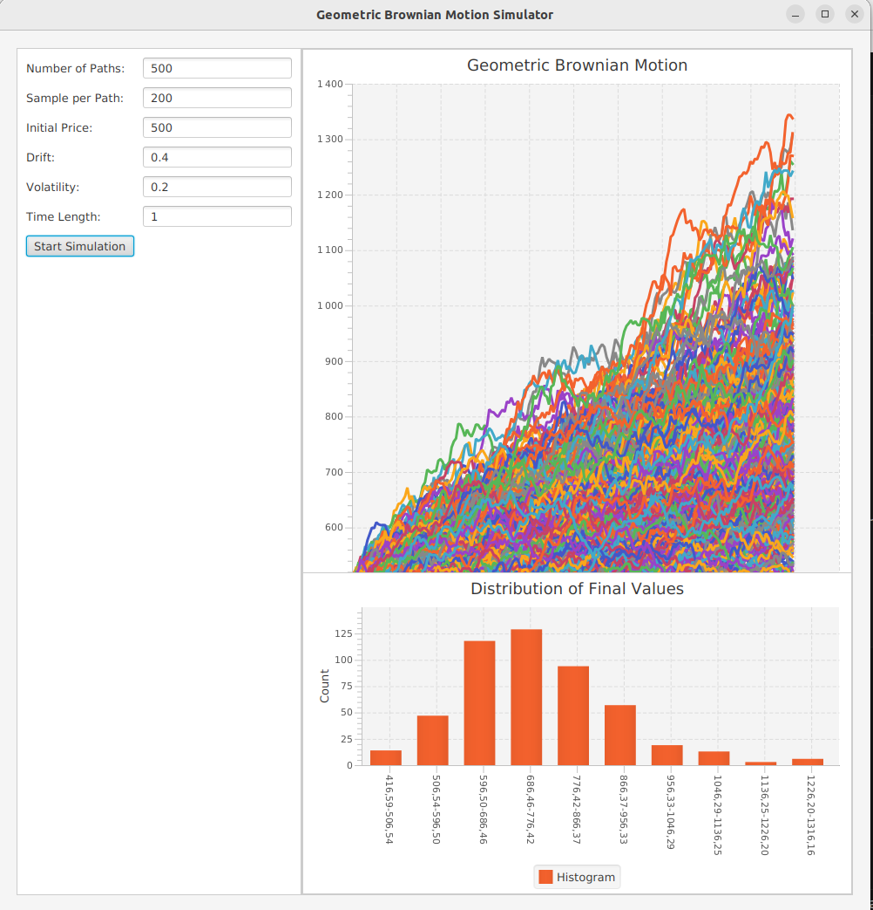

# Geometric Brownian Motion Simulator

This project is a Geometric Brownian Motion (GBM) simulator implemented in Java using Gradle as the build tool. It generates GBM paths and displays them on a line chart, along with a histogram showing the distribution of final values.

## Geometric Brownian Motion (GBM)

The Geometric Brownian Motion (GBM) is a mathematical model commonly used to describe the evolution of prices in financial markets. It assumes that the logarithm of the price of an asset follows a stochastic process that resembles a Brownian motion with drift and volatility.

### GBM Equation
The equation for GBM is defined as follows: dS(t) = μS(t)dt + σS(t)dW(t)
where:
- dS(t) is the infinitesimal change in the price of the asset at time t.
- S(t) is the price of the asset at time t.
- μ is the drift or expected return of the asset.
- σ is the volatility of the asset.
- dW(t) is a random variable following a standard normal distribution, representing a Wiener process or Brownian motion.

### Application in Finance

GBM is widely used in finance, especially in option pricing and risk management. It provides a framework for simulating asset price paths and estimating various financial quantities, such as option prices, value at risk, and expected returns.

By simulating multiple paths based on the GBM equation, we can generate possible future price scenarios. These simulations can help assess the risk associated with different investment strategies and evaluate the pricing of complex financial instruments.

## Prerequisites

- Java Development Kit (JDK) 8 or above
- Gradle

## How to Run

1. Ensure you have Java and Gradle installed on your system.
2. Build the project by running the following command in the project directory:
3. Run the application using the following command:

## Usage

1. Enter the desired parameter values in the input fields on the left side of the application.
2. Click the "Start Simulation" button to generate the GBM paths and histogram.
3. The line chart on the center of the application will display the GBM paths.
4. The histogram below the line chart will show the distribution of final values.

## How the simulator looks like

## License

This project is licensed under the [MIT License](LICENSE).

Feel free to use, modify, and distribute this code according to the terms of the license.

## Author

Brice TAGO

If you have any questions or suggestions, please feel free to contact me.

